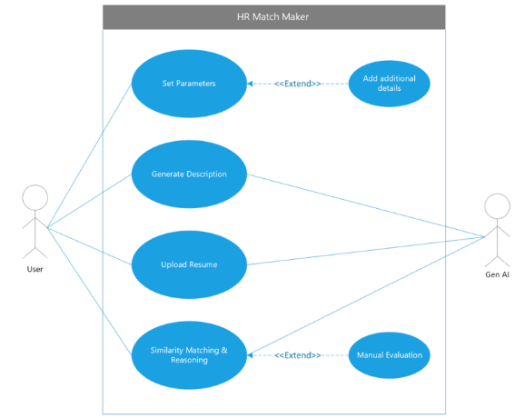
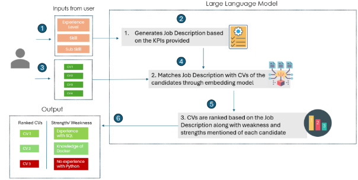
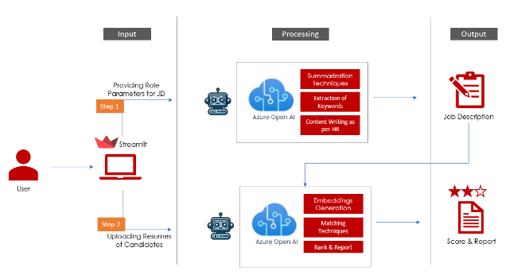

**HR Match Maker**

# **Abstract**

This project focuses on creating a Chatbot system for HR departments to streamline the initial stages of the recruitment process. The system utilizes artificial intelligence to assess job descriptions and candidates' resumes, providing HR professionals with an efficient tool for candidate shortlisting.

Key benefits include time savings through automated resume screening, improved objectivity in candidate evaluation, and enhanced candidate experience with prompt feedback.

In summary, this Chatbot system aims to simplify recruitment processes, making them more efficient and fairer for both HR professionals and candidates.

***Keywords:***

LLM - Large Language Models

DB - Database

API – Application Programming Interface

AI – Artificial Intelligence

Gen AI – Generative AI

GPT – Generative Pretraining Transformer

HR – Human Resources

# **Introduction**
While advancements in technology have transformed various aspects of HR management, the industry continues to grapple with several persistent challenges that affect recruitment processes. These challenges underscore the critical need for innovative solutions such as the proposed Chatbot assistance system:

**Overwhelming Volume of Applications:**

**Subjective Bias in Screening:**

**Time-Intensive Manual Processes:**

**Candidate Expectations for Swift Feedback:**

**Alignment with Evolving Job Market Needs:**

**Pressure to Enhance Employer Branding:**

Addressing these challenges requires innovative solutions that not only automate and streamline processes but also enhance the objectivity and efficiency of candidate evaluation. Our Chatbot assistance system aims to alleviate these pain points by providing HR professionals with a reliable tool for efficient resume screening and candidate matching, thereby improving overall recruitment outcomes.

The project is designed to generate matching scores between job descriptions (JD) and candidates' resumes. Through the integration of artificial intelligence, this system seeks to streamline the initial stages of the recruitment process

## **Key Benefits** 
**Time Efficiency:**
**Improved Accuracy:** 
**Enhanced Candidate Experience:** 

# **Project Scope**
This project aims to develop a specialized Chatbot system tailored specifically for HR departments, integrating Generative AI technology. The primary objective of the system is to automate and streamline the initial stages of the recruitment process by generating accurate matching scores between job descriptions (JD) and candidates' resumes. The project will involve the following key tasks:

- **Designing a User-Friendly Interface:**
- **Implementing Generative AI for Job Description:**
- **Implementing Generative AI for Matching Scores:**
- **Enhancing Natural Language Understanding:**
- 
In summary, this project represents a targeted effort to harness Generative AI technology to address specific challenges within HR recruitment processes. By automating initial screening tasks and enhancing accuracy through advanced AI capabilities, the system aims to optimize HR professionals' efficiency while improving overall recruitment outcomes.

## **User and System Interaction**

There are 2 actors in the system 

- User (HR Personnel)
- System (Generative AI)

Interactions:

User

- User sets parameters 
- Generates job description
- Uploads Resume 
- Evaluate Results

System

- Generates job description
- Create embeddings
- Does similarity match and scoring

# **Solution Design**
## **Application Flow**

**Flow:**

The project flow for the Chatbot system designed for HR departments unfolds as follows:

- Setting up Required Parameters:
- Providing Additional Requirements:
- Generating Job Description (JD):
- Uploading Candidates' Profiles:
- Generating Scores and Reasoning using AI:

By following this flow, the Chatbot facilitates a systematic approach to recruitment, ensuring that both job descriptions and candidate evaluations are grounded in objective criteria and comprehensive analysis.

2. ## **Technical Architecture**

The Chatbot system for HR departments integrates several essential technology components to ensure functionality, efficiency, and user-friendliness:

- **Python:**
- **Langchain:**
- **FAISS (Facebook AI Similarity Search):**
- **Azure Open AI model GPT 3.5 16k Turbo:**
- **Streamlit:**

Each selected technology component plays a critical role in the system's architecture, contributing to its functionality, performance, and usability. The combination of Python for orchestration, Langchain for LLM application management, FAISS for vector database operations, Azure Open AI for advanced language processing, and Streamlit for interface development ensures that the Chatbot system meets the specific needs of HR departments effectively and efficiently.

# **Deployment and End Result**

The application is developed on Streamlit and can be deployed on the same server on Free Tier.

# **Future Enhancements**
As technology advances and user requirements evolve, it is prudent to outline potential future enhancements aimed at augmenting the effectiveness and efficiency of the system. 

Below are specific recommendations to enrich the functionality of the system:

- **Integration of React for Enhanced Frontend:**  
- **Introduction of Session Management:**  
- **Deployment as an API for Seamless Integration:**  
- **Implementation of Interview Plan and Questions:**  
- **Capability to Record Candidate Responses using Generative AI:**  

These future enhancements aim to further elevate the functionality and utility of the system, aligning it with evolving technological trends and enhancing its value proposition to HR departments. By focusing on these recommendations, the system can adapt and scale effectively to meet the dynamic needs of recruitment processes while ensuring optimal user experience and operational efficiency.

# **Demo of Results:**

[**Demo Link for HR Match Maker**](https://drive.google.com/file/d/1_tpmQiaErGEDCpqY-2fioDng8aNOB4ug/view?usp=sharing)
